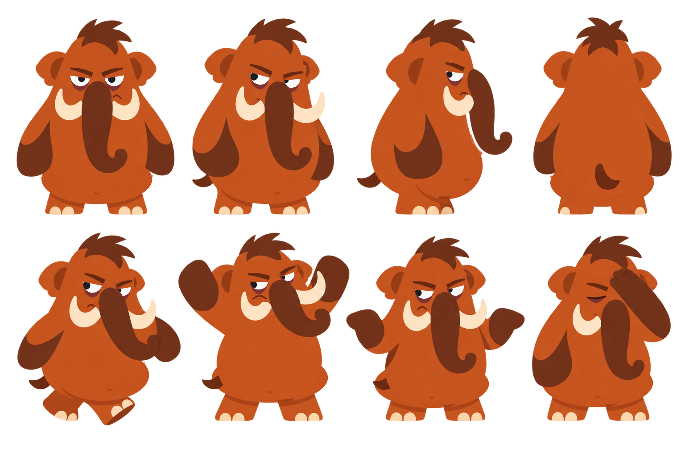

# Mamu



> Um mamute que sobreviveu à extinção, mas ainda não conseguiu sobreviver às próprias desculpas.

Esta pasta explora o **Mamu** como personagem de um app de acompanhamento de hábitos voltado principalmente a **largar maus hábitos**. É uma exploração de conceito ligada ao BeeOut: a ideia é ir guardando aqui o personagem, as decisões e os motions.

## Estrutura

```
personagem-mamu/
├── conceito/
│   ├── personalidade.md   quem ele é, a contradição central, regras de escrita, falas
│   ├── visual.md          o que mudou da v1 para a v2, poses, paleta, regras
│   └── produto.md         onde ele aparece no app, perguntas abertas, cuidados
├── arte/
│   ├── mamu-v2.png        folha atual com as 8 poses (fundo transparente)
│   ├── mamu-v1-vs-v2.png  comparação com a original
│   ├── referencia/        arte original (v1)
│   └── fonte/editar.py    script que gera a v2 a partir da v1
└── motion/
    ├── README.md          índice dos motions + princípios de animação do Mamu
    ├── _modelo.md         ficha para copiar quando surgir um motion novo
    └── Mxx-nome/          uma pasta por motion (ficha + arquivos)
```

## Como ir salvando

| Quero guardar… | Onde |
|---|---|
| Uma ideia de personalidade, fala ou regra de tom | `conceito/personalidade.md` |
| Uma decisão visual | `conceito/visual.md` + uma linha no registro abaixo |
| Uma ideia de uso no produto | `conceito/produto.md` |
| Uma ideia de motion | copiar `motion/_modelo.md` para `motion/Mxx-nome/README.md` e adicionar ao índice |
| Arquivos de animação (animatic, projeto, export) | dentro da pasta do motion |
| Uma versão nova da arte | `arte/mamu-vN.png`, mantendo as anteriores |

## Registro de decisões

| Data | Decisão |
|---|---|
| 2026-10-09 | **v2 do visual:** mesma arte, formato e estilo da v1, com barriga mais saliente, olheiras e mau humor mais explícito (pálpebra mais baixa, sobrancelhas anguladas, boca para baixo). Detalhes em [visual.md](conceito/visual.md). |
