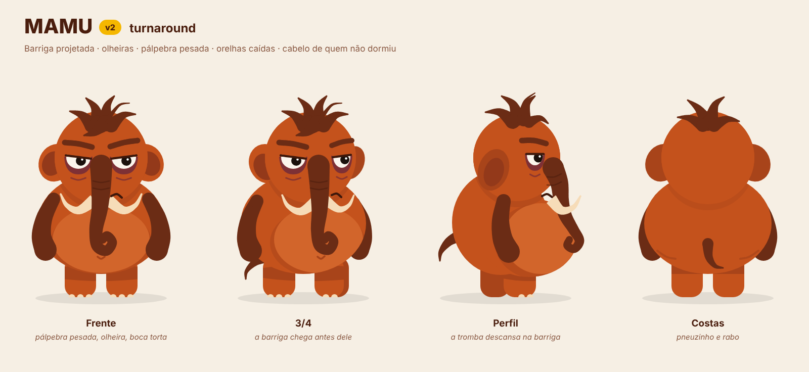

# Mamu



> Um mamute que sobreviveu à extinção, mas ainda não conseguiu sobreviver às próprias desculpas.

Esta pasta explora o **Mamu** como personagem de um app de acompanhamento de hábitos voltado principalmente a **largar maus hábitos**. É uma exploração de conceito ligada ao BeeOut: a ideia é ir guardando aqui o personagem, as decisões e os motions.

## Estrutura

```
personagem-mamu/
├── conceito/
│   ├── personalidade.md   quem ele é, a contradição central, regras de escrita, falas
│   ├── visual.md          guia visual v2: o que mudou e por quê, paleta, construção, regras
│   └── produto.md         onde ele aparece no app, perguntas abertas, cuidados
├── arte/
│   ├── mamu-v2-*.svg|png  frente (camadas nomeadas), turnaround, poses, expressões
│   ├── mamu-v1-vs-v2.png  comparação com a arte original
│   ├── referencia/        arte original (v1)
│   └── fonte/             código que gera as artes (novas poses saem daqui)
└── motion/
    ├── README.md          índice dos motions + princípios de animação do Mamu
    ├── _modelo.md         ficha para copiar quando surgir um motion novo
    └── Mxx-nome/          uma pasta por motion (ficha + arquivos)
```

## Como ir salvando

| Quero guardar… | Onde |
|---|---|
| Uma ideia de personalidade, fala ou regra de tom | `conceito/personalidade.md` |
| Uma decisão visual | `conceito/visual.md` + uma linha no registro abaixo |
| Uma ideia de uso no produto | `conceito/produto.md` |
| Uma ideia de motion | copiar `motion/_modelo.md` para `motion/Mxx-nome/README.md` e adicionar ao índice |
| Arquivos de animação (animatic, projeto, export) | dentro da pasta do motion |
| Pose ou expressão nova | `arte/fonte/poses.py` ou `expressoes.py`, depois `python3 gerar.py` |

## Registro de decisões

| Data | Decisão |
|---|---|
| 2026-10-09 | **v2 do visual:** barriga projetada, olheiras permanentes, pálpebra pesada, sobrancelhas baixas, boca torta, orelhas caídas e cabelo bagunçado, mantendo o estilo chapado e minimalista da v1. Detalhes em [visual.md](conceito/visual.md). |
| 2026-10-09 | Amarelo BeeOut (`#F5B700`) entra só como acento em acessórios. |
| 2026-10-09 | Primeiro protótipo de motion: [M00 idle](motion/M00-idle/) (respira, pisca, fuma). |
