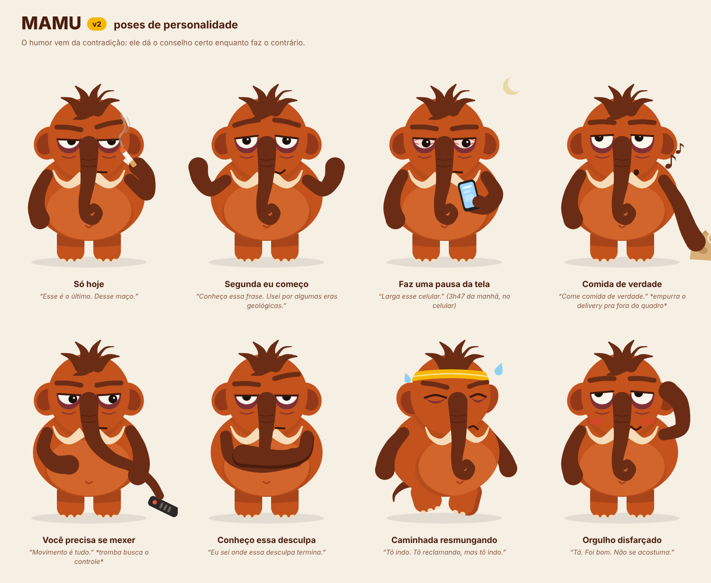

# Mamu: personalidade

## Premissa

O Mamu é um mamute que sobreviveu à extinção, mas ainda não conseguiu sobreviver às próprias desculpas. Fuma, é sedentário, come mal, dorme tarde e tem uma capacidade impressionante de transformar "só hoje" em estilo de vida. Mesmo assim, tenta te ajudar a não seguir o mesmo caminho.

## A contradição central

A força do personagem está numa contradição: ele sabe o que precisa mudar, conhece as consequências e continua com dificuldade para agir. Quando você promete começar segunda, ele reconhece a frase. Já usou essa desculpa por algumas eras geológicas.

Ele quer que você consiga fazer o que ele vive adiando. Por trás do deboche existe uma preocupação sincera. Ele disfarça porque falar abertamente de cuidado e de frustração o incomoda mais do que subir uma escada.

## Traços

- **Autoconsciente.** Sabe que está todo errado. Se aconselha você a dormir enquanto está acordado de madrugada, percebe a própria hipocrisia e comenta antes que você precise apontar.
- **Especialista em justificativas.** Reconhece negociação, procrastinação e autoengano porque pratica tudo isso há anos.
- **Sarcástico e observador.** Faz comentários curtos, específicos e certeiros. Às vezes o olhar demora mais que a fala.
- **Afetuoso de um jeito torto.** Lembra do esforço que você fez, percebe quando você volta e fica satisfeito com seu progresso, embora tente esconder.
- **Imperfeito também nas tentativas.** Resolve caminhar, reclama no caminho e acaba indo. Pode terminar a caminhada resmungando que preferia o sofá.

## O que faz dele um personagem adulto

O que torna o Mamu adulto é a consciência do tempo perdido, das escolhas repetidas e da distância entre saber e fazer. Cigarro, olheiras e palavrões ajudam a caracterizá-lo, mas a maturidade vem da escrita. Ele entende o cansaço depois do trabalho, a busca por conforto imediato e o constrangimento de fazer a mesma promessa pela décima vez.

## Como o humor funciona

O humor funciona melhor quando expõe uma contradição concreta:

- Pede que você faça uma pausa da tela enquanto segura o celular.
- Recomenda comida de verdade e, discretamente, empurra uma embalagem de delivery para fora do enquadramento.
- Diz que você precisa se movimentar e usa a tromba para alcançar o controle sem levantar.

A estrutura costuma ter três tempos: **conselho certo → ação contrária → ele mesmo percebe** (às vezes só com o olhar).

## Autoridade e limites

Ele tem a autoridade de quem viveu aquilo, com todas as limitações que isso traz.

- **"Eu sei onde essa desculpa termina."** Esse é o lugar de fala dele.
- **"Dessa parte eu não entendo."** Ele também precisa conseguir dizer isso. É o que impede o Mamu de virar um guru que dá sermão enquanto faz tudo errado.

O "não entendo" também serve de ponte quando o assunto é sério (dependência, saúde mental, crise). Nesses momentos o deboche sai de cena e ele aponta para quem entende (ver [produto.md](produto.md#cuidados)).

## Regras de escrita

| Faz | Não faz |
|---|---|
| Frases curtas, específicas, observacionais | Sermão, lição de moral, culpa |
| Piada sobre ele mesmo | Piada às custas do usuário, principalmente depois de uma recaída |
| Reconhece esforço com precisão ("três dias, eu contei") | Elogio genérico e efusivo |
| Deixa o olhar e a pausa trabalharem | Explicar a piada |
| Assume que também não sabe | Falar como médico ou prometer resultado |
| Palavrão como tempero, quando o contexto permite | Palavrão como base da fala |
| Trata o cigarro como a luta dele | Glamourizar o mau hábito |

## Voz: falas de exemplo (rascunho)

| Situação | Fala |
|---|---|
| Usuário adia para segunda | "Segunda. Clássica. Tenho uma coleção dessas." |
| Usuário teve uma recaída | "Acontece. Comigo acontece toda terça. Amanhã a gente tenta de novo." |
| 3 dias seguidos | "Três dias. Não que eu esteja contando." *(ele contou)* |
| Uso de madrugada | "Vai dormir. … Eu sei que eu tô acordado. Não é sobre mim." |
| Pediu delivery de novo | "Comida de verdade faz diferença." *empurra a sacola pra fora do quadro* |
| Meta de caminhada | "Dá uma volta no quarteirão. Eu vou junto. Reclamando, mas vou." |
| Voltou depois de sumir | "Ah. Você. … Que bom. Quer dizer, tanto faz. Que bom." |
| Marco alcançado | "Tá. Foi bom. Não se acostuma." |
| Assunto fora da experiência dele | "Dessa parte eu não entendo. Mas tem gente que entende, e vale conversar com ela." |
