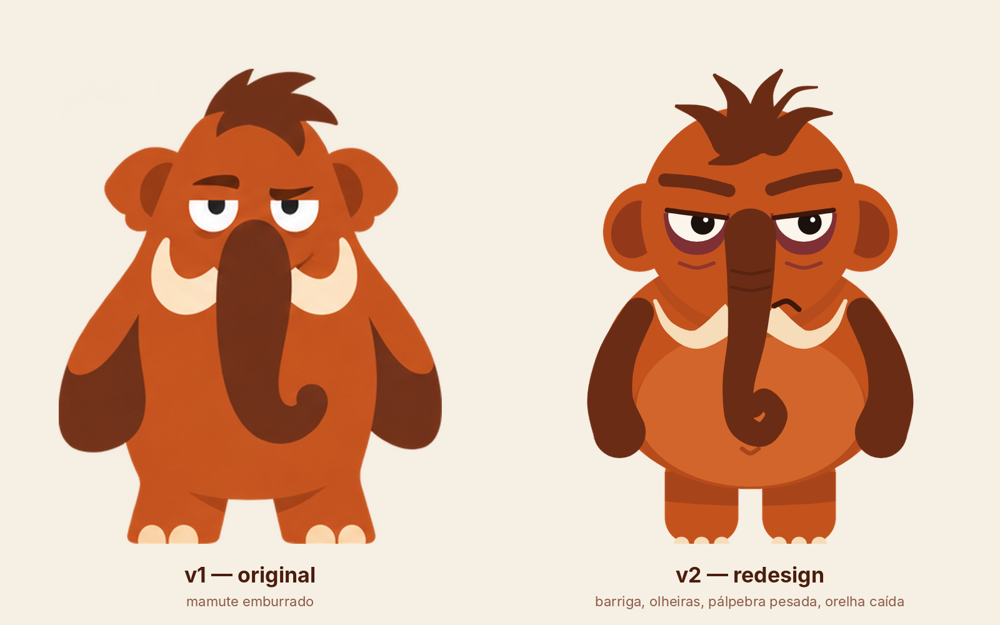
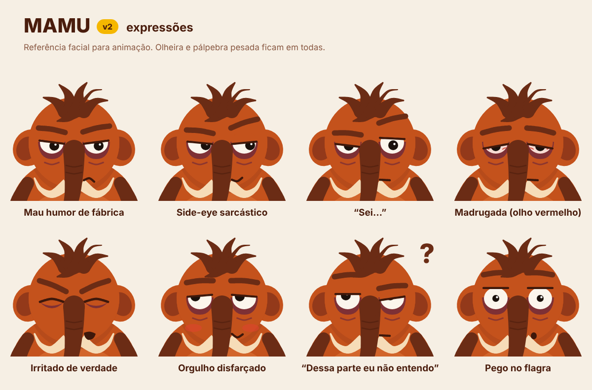

# Mamu: guia visual (v2)




## O que mudou da v1 para a v2

Cada mudança responde a um traço da [personalidade](personalidade.md). O estilo continua o mesmo: formas chapadas, sem contorno, poucas cores.

| Mudança | Por quê |
|---|---|
| **Barriga projetada**, um tom mais clara, com sombra caindo nas pernas | Sedentarismo. No perfil a barriga chega antes dele, e a tromba descansa em cima dela. |
| **Olheiras roxas permanentes** | Dorme tarde. É a marca registrada: aparecem em todas as expressões, até nas felizes. |
| **Pálpebra pesada** (cobre cerca de metade do olho), levemente inclinada | Cansaço e mau humor juntos, sem cara de raiva. |
| **Sobrancelhas grossas**, baixas e anguladas | Mau humor explícito e legível mesmo em tamanho de ícone. |
| **Boca torta para baixo** ao lado da tromba | O resmungo constante. |
| **Orelhas caídas** (giradas para fora e para baixo) | Desânimo e preguiça. |
| **Cabelo em mechas desencontradas** + um fio rebelde | Cara de quem acabou de acordar, ou de quem nem dormiu. |
| **Sombra de queixo** | Sugere papada e corpo largado. |
| **Braços apoiados na barriga**, pernas mais curtas | Peso e postura largada. |

**Mantido da v1:** paleta laranja, marrom e creme, tromba com caracol na ponta, presas e unhas creme, cabelo marrom no topo.

## Paleta

| Uso | Hex |
|---|---|
| Corpo | `#C4521C` |
| Sombra do corpo | `#A8441A` |
| Barriga | `#D2652B` |
| Tromba, braços, cabelo, sobrancelhas | `#6B2C15` |
| Rugas da tromba, separação entre braços | `#4A1D0D` |
| Interior da orelha | `#93391A` |
| Presas e unhas | `#F6DCB8` |
| Branco do olho | `#FBF5EC` |
| Pupila | `#1B110C` |
| **Olheira** | `#7E3035` |
| Pálpebra e boca | `#3E180B` |
| Acento (acessórios, como a faixa da caminhada) | `#F5B700` (amarelo BeeOut) |

## Construção

- **Silhueta:** cabeça circular sobre um corpo em forma de pera, mais largo embaixo. A cabeça mede cerca de 0,73 da largura do corpo. Altura total de mais ou menos 2,2 cabeças.
- **Barriga:** elipse clara no terço inferior, ocupando uns 75% da largura do corpo e cobrindo o topo das pernas.
- **Membros:** tromba, braços, presas, rabo e mechas são traços que afinam ao longo de uma curva. A tromba afina de 44 para 16 e termina em caracol.
- **Olho:** elipse levemente larga. A pálpebra tem a cor do corpo e uma linha escura na borda. Por padrão a pupila fica deslocada para o lado (side-eye).
- **Sombra:** uma cor só (`#A8441A`), usada no queixo, embaixo da barriga e no lado de trás nas vistas 3/4 e perfil.

## Regras

- Olheira sempre.
- A pálpebra nunca fica totalmente aberta, exceto em "pego no flagra", e aí ela é a piada.
- O sorriso é sempre pequeno e meio escondido pela tromba.
- O cigarro aparece como o hábito *dele*, sem glamour: fumaça cinza, sem pose de "cool". Não aparece em telas de conquista do usuário.
- O amarelo BeeOut só entra em acessórios, nunca no corpo.

## Expressões



## Arquivos

| Arquivo | O que é |
|---|---|
| `arte/mamu-v2-frente.svg` | Personagem isolado, fundo transparente, **camadas nomeadas** (`pernas`, `orelhas`, `corpo`, `cabelo`, `olhos`, `sobrancelhas`, `presas`, `boca`, `tromba`, `bracos`) para importar no Figma, After Effects ou Rive |
| `arte/mamu-v2-turnaround.*` | Frente, 3/4, perfil e costas |
| `arte/mamu-v2-poses.*` | Poses de personalidade |
| `arte/mamu-v2-expressoes.*` | Expressões faciais |
| `arte/mamu-v1-vs-v2.png` | Comparação com a arte original |
| `arte/referencia/mamu-v1-original.png` | Arte original (v1) |
| `arte/fonte/` | Código que gera tudo acima |

### Gerar ou editar as artes

As artes são geradas por código. Para criar uma pose nova, copie uma entrada de `arte/fonte/poses.py` e ajuste olhos, sobrancelhas, braços e tromba (as opções estão documentadas em `front()` dentro de `mamu.py`).

```bash
cd personagem-mamu/arte/fonte
python3 gerar.py   # gera os SVGs; os PNGs saem se houver node + playwright
```
