# M00: Idle "Só hoje"

| | |
|---|---|
| **Status** | Protótipo: [`mamu-idle.svg`](mamu-idle.svg) (abra no navegador) |
| **Gatilho no app** | Mamu parado na tela (home, check-in) |
| **Duração** | Loop: respiração de 3,6 s, piscada a cada 5,2 s, fumaça a cada 1,6 s |
| **Loop** | sim |
| **Formato** | SVG + CSS (protótipo) → Lottie/Rive no app |
| **Pose** | "Só hoje" ([poses](../../arte/mamu-v2-poses.png)) |

## Ideia em uma frase

O estado normal do Mamu: largado, de olho meio fechado, com um cigarro "só hoje" na mão.

## O que já está no protótipo

| Camada | Animação |
|---|---|
| Corpo inteiro | Respiração lenta: escala 1 → 1,024 na vertical, ancorada nos pés |
| Olhos | Piscada pesada, às vezes dupla |
| Fumaça | Duas plumas alternadas que sobem e somem |
| Brasa | Pulsa entre laranja e amarelo |

Com `prefers-reduced-motion` ativado, tudo fica parado.

## Próximos passos

- [ ] Versão **sem cigarro** (idle neutro) para telas de conquista do usuário
- [ ] Variação: de vez em quando ele dá um side-eye para a câmera
- [ ] Ação secundária: a ponta da tromba mexe devagar
- [ ] Barriga com follow-through próprio, separada da respiração do corpo
